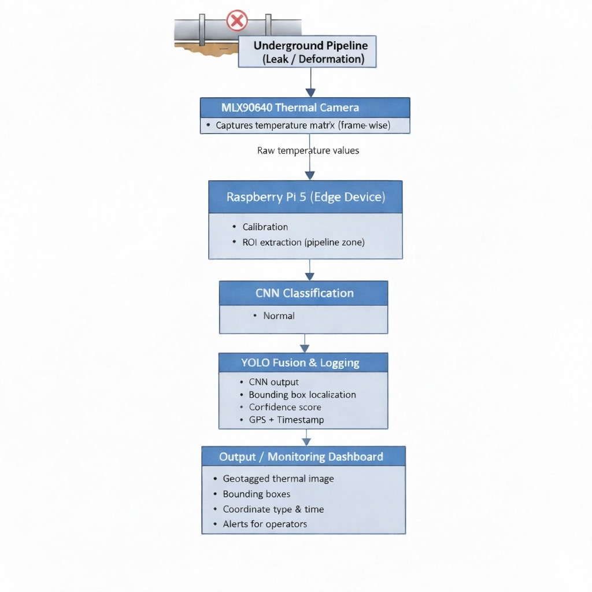
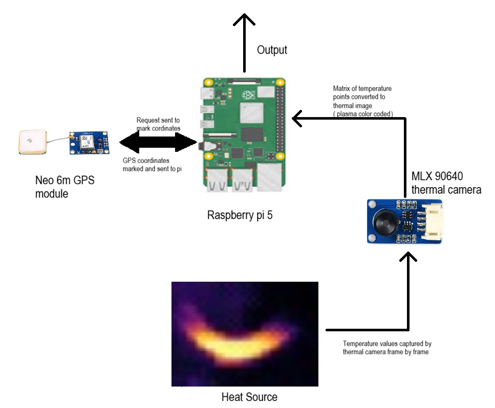
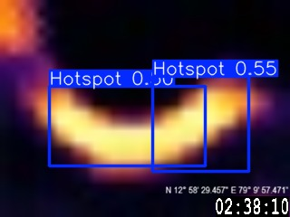
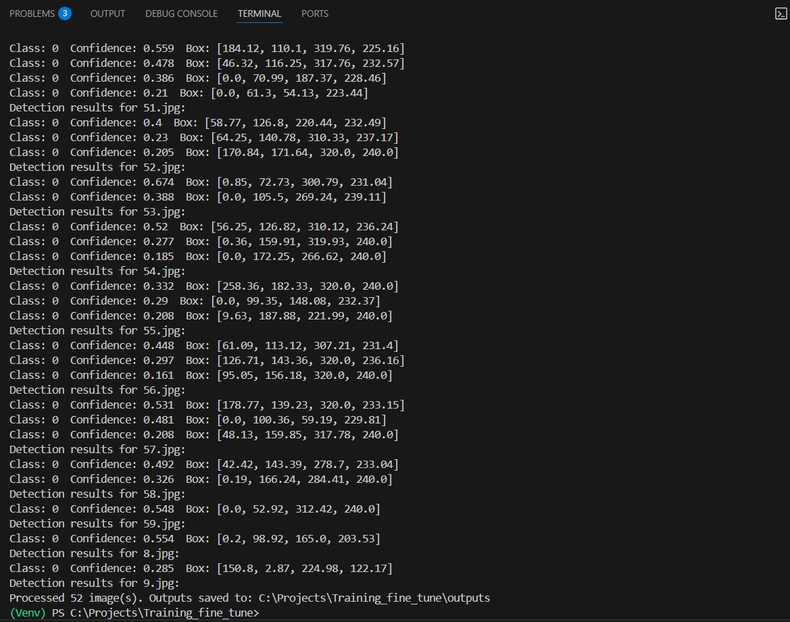
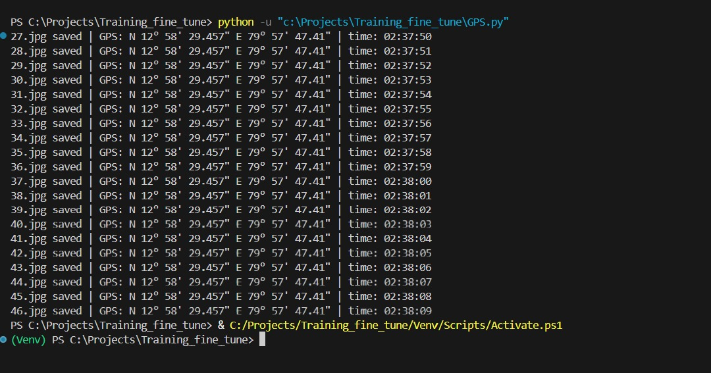

# UAV Thermal Imaging and Hotspot Detection

This project explores thermal imaging for pipeline inspection. The local codebase contains a ground based YOLOv8 hotspot detection proof of concept, thermal image preprocessing utilities, and an older image classification prototype. The figures and PDFs alongside this guide document the broader UAV mounted pipeline monitoring concept.

> **Implementation status:** The local scripts train and run YOLOv8 on thermal images. The UAV, GPS, timestamp, dashboard, and edge device shown in the concept diagrams describe the intended system; they are not all implemented by the scripts in this checkout.

## Concept and results

The system concept captures temperature frames with an MLX90640 thermal camera, processes them on a Raspberry Pi, and combines hotspot detection with location and time information for inspection records.



The component diagram illustrates how the Raspberry Pi, thermal camera, and GPS module exchange thermal frames and coordinate information.



## Hardware

The hardware photo shows the Raspberry Pi-based prototype connected to the thermal camera and GPS modules.


Example detection output, confidence score summary, and sample GPS and timestamp log from the project materials:

| Detection output | Confidence scores | GPS and timestamp log |
|---|---|---|
|  |  |  |

These images illustrate project artifacts; their presence does not mean the associated GPS acquisition or end to end UAV pipeline is implemented in the current local scripts.

## What is in this checkout

- **YOLOv8 training:** `Training_fine_tune/Model_training.py` trains an Ultralytics YOLO model using `Training_fine_tune/Training_dataset/data.yaml`. The checked-in run settings use one `Hotspot` class, 100 epochs, batch size 16, and an image size of 32 × 24.
- **Single-image inference:** `Training_fine_tune/Run.py` loads the trained `best.pt` checkpoint, reads images from `Training_fine_tune/inputs`, enlarges each to 320 × 240, and saves resized images, annotated images, and detection text under `Training_fine_tune/outputs`.
- **Video inference:** `Training_fine_tune/Run2.py` applies the same model to `video.mp4` and writes `output_detected_video.mp4`.
- **Image preparation:** `image_generator.py` crops image borders, adjusts the crop to a 4:3 aspect ratio, and resizes images to 32 × 24 in `Stock_32x24`.
- **Thermal CSV visualization:** `View_thermal_cloud.py` reads a thermal CSV matrix, normalizes it, and displays it with an Inferno colour map. It expects `DI-IP-TV-9Hz-sand_0.csv` or its fallback file in the working directory.
- **Legacy classifier:** `Automated-detection-of-hotspot-in-thermal-images-master/` contains an earlier VGG16/MobileNet feature extraction and logistic regression workflow, plus an Otsu threshold based region-of-interest helper and a Flask app. It is separate from the current YOLO training and inference scripts.

The dataset metadata reports 524 images annotated in YOLO format, with the class name `Hotspot`. Check `Training_fine_tune/Training_dataset/README.dataset.txt` and `data.yaml` for dataset provenance and configuration.

## Run the YOLO workflow

Run commands from the `Training_fine_tune` directory so the relative paths in the scripts resolve:

```powershell
cd Training_fine_tune
python -m venv .venv
.\.venv\Scripts\Activate.ps1
pip install ultralytics opencv-python torch
```

Train the model:

```powershell
python Model_training.py
```

Put supported image files in `inputs`, then run inference:

```powershell
python Run.py
```

`Run.py` expects a trained checkpoint at `runs/detect/yolov8s_32x24_colored7/weights/best.pt`. Confirm that this checkpoint exists, or update the path in the script to the run you trained. For video inference, set `input_video` in `Run2.py` to a video path, then run:

```powershell
python Run2.py
```

The training script selects CUDA when PyTorch can access it and otherwise selects CPU. The `gpu_test.py` and `python_test.py` files are small TensorFlow environment checks, not part of the YOLO pipeline.

## Repository figures and reference documents

- `1st_patent_Thermal_camera.pdf` — patent document supplied with the remote project.
- `hardware photo.pdf` — hardware reference document supplied with the remote project.
- `Data_flow.jpeg`, `Flowchart.jpeg` — system concept diagrams.
- `Output_image.jpeg`, `confidence_scores_ai.jpeg`, `Terminal_output_gps_and_timestamp.jpeg` — example outputs and logs.

## Notes and limitations

- The thermal sensor produces low resolution frames; resizing to 320 × 240 changes display and model input dimensions but does not add new thermal detail.
- Detection confidence and bounding boxes depend on the selected checkpoint and input data. Treat the screenshots as examples, not a measured accuracy guarantee.
- The data configuration identifies one class, `Hotspot`; it does not define separate classes for leak, deformation, or other fault types.
- The current scripts do not implement UAV flight control, live GPS capture, timestamp synchronization, or an operator dashboard.
- Training and inference depend on the Python packages and checkpoint files being available locally. The root of this repository does not provide one shared dependency lock file for all the separate workflows.
